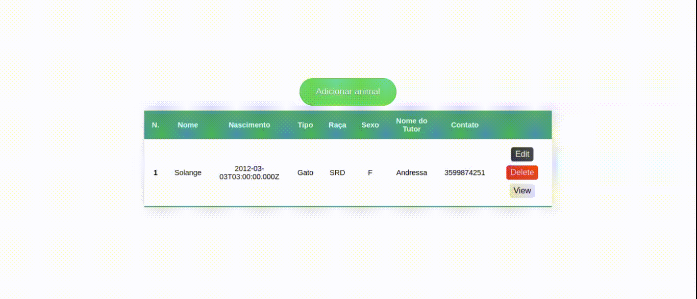
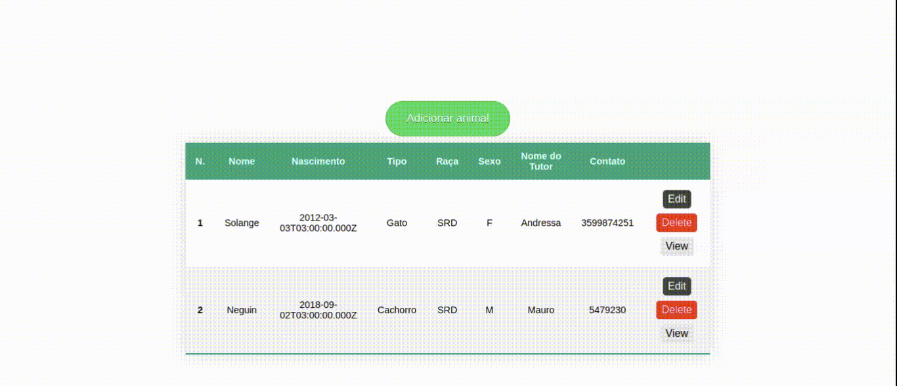
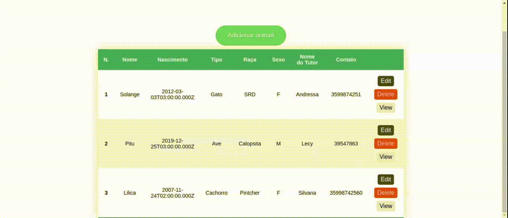

# Petshop 

 
 
 
 
 

  

> Inserindo/criando um animal.

> Deletando animal da lista e banco de dados.

> Card que contém todas as informações do animal, inclusive seu ID único.

> Update nas informações dos animais e tutores.

### Ajustes e melhorias

O projeto ainda está em desenvolvimento e as próximas atualizações serão voltadas nas seguintes tarefas:

- [ ] Correção do formato da data de nascimento (campo de update). No formato atual, o update é realizado quando a data é inserida no formato aaaa-mm-dd
- [ ] Obter a idade á partir da data de nascimento
- [ ] Aplicação Redux

## 💻 Pré-requisitos

Antes de começar, verifique se você atendeu aos seguintes requisitos:
<!---Estes são apenas requisitos de exemplo. Adicionar, duplicar ou remover conforme necessário--->
* Você instalou a versão 8.0 do mysql
* Você instalou o nodemon para rodar o servidor

Detalhes: 
* Este projeto foi criado no SO linux 20.4.

## 🚀 Passo a passo

Para rodar a aplicação, siga estas etapas:

* Faça um clone deste repositório;
* Entre no diretório server da aplicação;
* Execute o server da aplicação utilizando: nodemon index.js
* Após o servidor rodar na porta localhost:5000, vá até o diretório client;
* Dentro do diretório client, inicie o frontend através do comando: npm start 
  

[⬆ Voltar ao topo](#petshop) 
