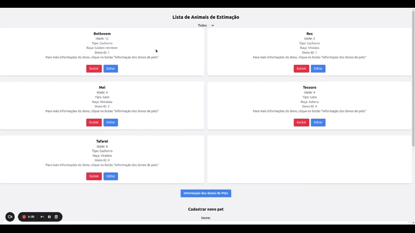
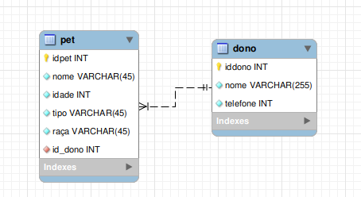

# Desafio - Vaga - Desenvolvedor Fullstack Júnior
- Email: bacelardouglas@outlook.com
- Contato: (81) 99672-3427

# 🐶 🐱 Recuit PetShop

  

## Instalação

Siga este passo a passo para testar este repositório.

Clone o repositório para sua máquina local


Acesse a pasta

```
$ cd desafio-dev-fullstack-jr
```

Certifique-se que você está na branch correta

```
$ git checkout douglas-bacelar-petshop-project
```

Inicie a aplicação com o Docker Compose

```
$ docker-compose up -d
```

O comando acima realiza o build do arquivo `docker-compose.yml` construindo todas as imagens necessárias e inicializa todos os containers configurados.

## Como utilizar?

1. Cetifique-se de seguir todos os passos de instação.
2. Verifique se todos os containers foram iniciados.

```sh
$ docker ps
```

O retorno deve conter 3 containers ativos `frontend` | `backend` | `mysql`.

### Acessando o backend

Acesse o container backEnd com o seguinte comando `docker exec -it backend bash`, rode o comando `npm install` para instalar as dependencias e o `npm run dev` para iniciar a Aplicação. A API estará sendo executada na porta 3333, é possível verificar o acesso em uma rota GET `http://localhost:3333` o retorno é um objeto com a message,
`"message": "API no Ar"`.

### Acessando o frontend

Acesse o container frontEnd com o seguinte comando `docker exec -it frontend bash`, rode o comando `npm install` para instalar as dependencias e o `npm start` para iniciar a Aplicação. A página do frontend deve ser renderizado no endereço `http://localhost:3000/pets`, sua página inicial renderiza os dados retornados da api.

## Estrategias para elaboração da aplicação

Utilizei o docker na aplicação buscando reduzir as diferenças entre ambientes de desenvolvimento e produção, assim como melhor gestão das dependências.

Optei por implementar o modelo de arquitetura em camadas no backend no padrão MSC, para reduzir a responsabilidade da camada de Model, delegando a tratativa das regras de negócio para uma camada Service. Como foi sugerido o uso de React no front, optei por desenvolver uma API, ao invés de fazer a renderização server side para que o consumo dos dados da aplicação backend se torne flexível, podendo ser utilizado por diferentes clients.

Também utilizei o uso do banco de dados Mysql para guardar as informações dos donos e pets. Elaborei os testes unitários da aplicação backend, conseguindo mais de 70% de cobertura das funções. Assim como middlewares para validação do campo do telefone do dono do Pet.

## Visualização do relacionamento entre as tabelas do banco de dados do petshop

  

## Tecnologias utilizadas

> JavaScript

> Dockerfile e Docker Compose

> Node.js

> Express

> Tailwind.CSS

> React

> MySQL

> Testes (Chai, Mocha e Sinon)

> Nodemon

## Instruções do Desafio
- Faça um fork deste repositório;
- O conjunto mínimo de tecnologias a serem utilizadas são: HTML, CSS e JavaScript no front-end e alguma das tecnologias back-end informadas na proposta desse desafio;
- Crie um passo a passo de como rodar a sua aplicação;
- Após finalizar, submeta um pull request com um comentário informando o seu e-mail de contato e aguarde nossa avaliação.

## Proposta
Você deverá desenvolver um projeto no padrão MVC utilizando Node.js com a finalidade de que seja possível listar, visualizar, criar, editar e excluir animais de estimação de uma petshop.
> **Observações:**
> - Você pode utilizar a estratégia que considerar pertinente para armazenar os registros de sua aplicação;
> - Cada animal de estimação precisa ter um identificador único, nome, idade, se é gato ou cachorro e sua respectiva raça; Além do nome e telefone para contato de seu dono.

## Diferenciais
Serão considerados diferenciais o uso de qualquer tipo de framework utilizados no front-end (utilizamos ReactJS por aqui) ou no back-end da aplicação.
